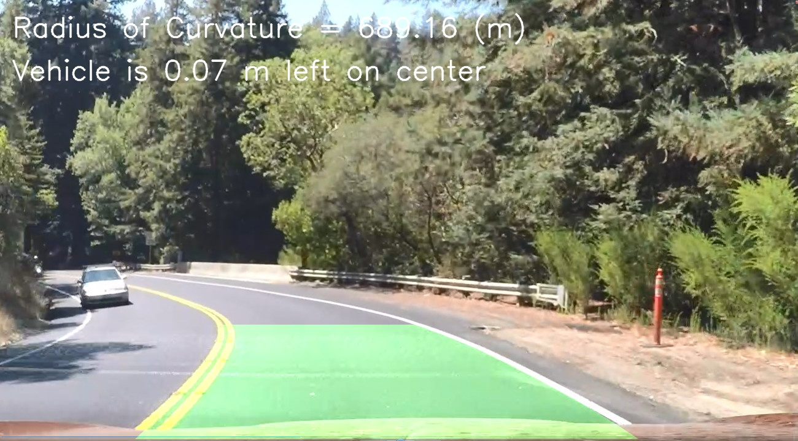

# CarND-Advanced-Lane-Lines
Second task of Self-Driving Car Engineer Nanogree Udacity Program

## Goal
Write a software pipeline to identify the lane boundaries in a video.

### Steps of this project are the following:

* Compute the camera calibration matrix and distortion coefficients given a set of chessboard images.
* Apply a distortion correction to raw images.
* Use color transforms, gradients, etc., to create a thresholded binary image.
* Apply a perspective transform to rectify binary image ("birds-eye view").
* Detect lane pixels and fit to find the lane boundary.
* Determine the curvature of the lane and vehicle position with respect to center.
* Warp the detected lane boundaries back onto the original image.
* Output visual display of the lane boundaries and numerical estimation of lane curvature and vehicle position.

Repository description
---
* #### camera_cal
  Contains calibration images set

* #### output_images
  Contains resulting images of implemented pipeline

* #### Project
  Contains source code. Test pipelines on test images or video in main.
  Or test individual steps in corresponding files.

* #### test_images
  Contains input images for testing and tuning the pipeline

* #### videos
  Videos on which pipeline was tested. Sources and results.

* #### write_up_sources
  Images used to generate write up html.

* #### project2.ipynb
  Jupyter notebook used to generate write up html.

* #### WriteUp.html
  Write up of the project in jupyter notebook form exported to html.
  Contains pipeline description, intermediate results images and reflection.